<div align="center">

<!-- troque pelo seu nome -->
# Vinicius Engelmann

Full Stack Developer · Brazil

<!-- troque pelos seus dados reais -->
```bash
echo $ABOUT_ME
--------------
21 years old, based in Brazil
3+ years of experience in software development
Full Stack Developer — Node.js, TypeScript, React
Systems Analysis and Development (ADS) graduate
AI enthusiast
--------------
```

<!-- troque pelo seu e-mail e LinkedIn -->
<a href="mailto:viniciusengelmanndev@gmail.com"></a>
<a href="https://www.linkedin.com/in/vinicius-engelmann-b8764b234/"></a>

</div>

<br/>

### Stack

<div align="center">


</div>

<br/>

### Projects

<!-- adicione uma descrição curta (About) nesses repositórios no GitHub, ela aparece automaticamente no card -->
<!-- troque client_acquisition/register_addresses pelos repositórios que você quiser destacar (e ajuste o workflow em .github/workflows/update-readme-cards.yml) -->
<!-- estes cards são gerados pela GitHub Action e commitados em profile/*.svg, não dependem de nenhum serviço externo no ar -->
<div align="center">

<a href="https://github.com/viniieng/client_acquisition"></a>
<a href="https://github.com/viniieng/register_addresses"></a>

</div>

<br/>

### Activity

<!-- stats e top-langs são gerados pela GitHub Action (profile/*.svg); só o streak ainda vem de um serviço externo -->
<div align="center">




<br/>


</div>
